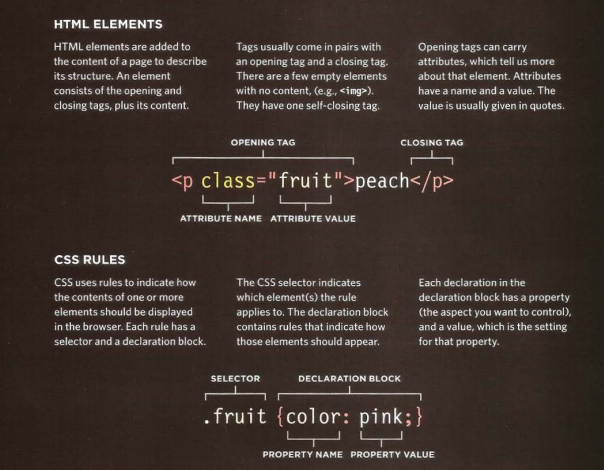
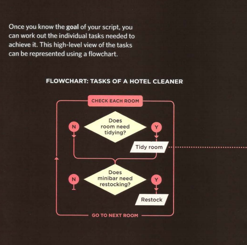
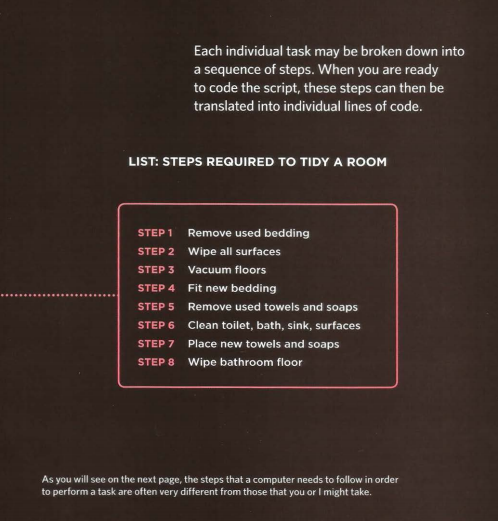
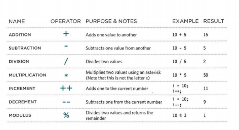
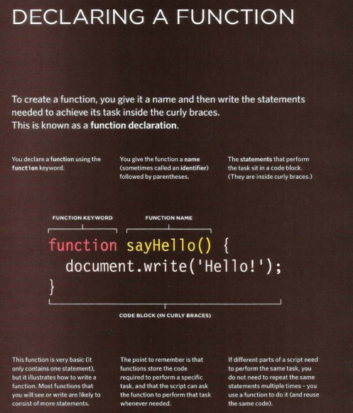
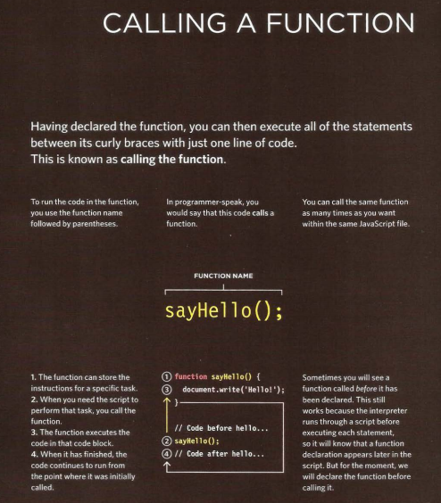
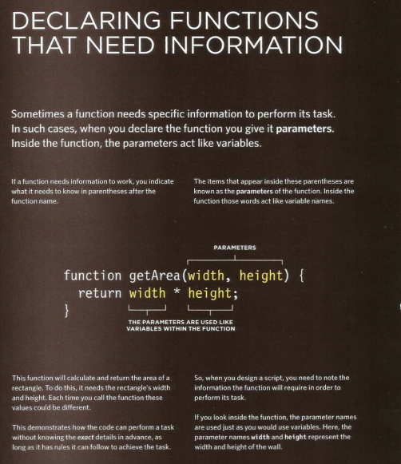
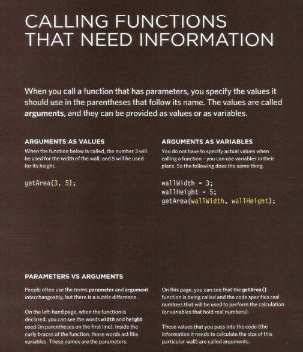
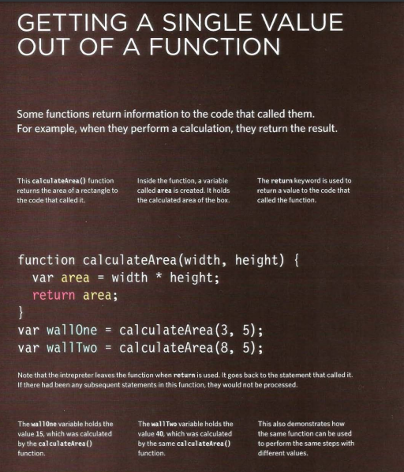

# **JAVASCRIPT**

### **Introduction** 

- Javascripts can be used in browsers to make website more interactive by respounding to whta the user does, interesting, and user-friendly `by :`

1. **ACCESS CONTENT :**You can use JavaScript to select any
element, attribute, or text from an HTML page.
  * Select the text inside all of the <hl>elements on a page
  + Select any elements that have a class attribute with a value of note
  * Find out what was entered into a text input whose id attribute has a value of email
2. **MODIFY CONTENT:**You can use JavaScript to add
elements, attributes, and text to the page, or remove them.
  - Add a paragraph of text after the first <hl> element
  - Change the value of class attributes to trigger new CSS rules
3. **PROGRAM RULES:**You can specify a set of steps for
the browser to follow (like a recipe),which allows it to access or change the content of a page.
   -  A gallery script could check which image a user clicked on and display a larger version of that image. 


4. **REACT TO EVENTS:**You can specify that a script should run when a specific event has occurrede, it could be run when:
   - A button is pressed
   - A link is clicked (or tapped) on
   - A cursor hovers over an element 

-----------------------------------------------------------

#### **JAVASCRIPT IN THE BROWSER**
- Access the content of the page
- Modify the content of the page
- Program rules or instructions the browser can follow
- React to events triggered by the user or browser 

**```Before getting deep in the javascript this is a quiqk refresh for HTML & CSS:```**


---------------------------------------------------------
**```Before you learn how to read and write the JavaScript
language itself, you need to become familiar with some key
concepts in computer programming and they are :```**

***What is a script and how do I create one?*** 
   - A script is a series of instructions that a computer can follow step by step to achieve a goal. `Sicript could be :`
       - RECIPES
       - HANDBOOKS
       - MANUALS

>A browser may use different parts of the script depending on how the user interacts with the web page.
>Script can run different sections of the code in response to the situation around them.

--------------------

##### WRITING A SCRIPT
- To write a script, you need to first state your goal and then list the
tasks that need to be completed in order to achieve it. 

- Start with the big picture of what you want to achieve, and break
that down into following steps :
    1. DEFINE THE GOAL :First, you need to define the task you want to achieve. You can think of this as a puzzle for the computer to solve. 
    2. DESIGN THE SCRIPT : To design a script you split the goal out into a series of tasks that are going to be involved in solving this puzzle.
    3. CODE EACH STEP : Each of the steps needs to be written in a programming language that the computer understands. In our case, this is JavaScript. 

------------------------------------------------------------

>Designing a script diagram:
 


----------------------------------------------------------

##### FROM STEPS TO CODE
- Every step for every task shown in a flowchart needs to be written
in a language the computer can understand and follow.`You should focus in :`

  - You need to get to work with the:
    • Vocabulary: The words that computers understand
    • Syntax: How you put those words together to create instructions computers can follow

  - You need to learn to "think" like a computer because they solve
tasks in different ways than you or I might approach them. 

>So To approach writing a script, break down your goal into a series of tasks and then work out each step needed to complete that task (a flowchart can help). 

------------------------------------------------------------------------------------------------------------------------


### **Basic javascript instructions:**

**1. EXPRESSIONS:**
  - Evaluates into (results in) a single value,there are `two types of expressions:`
    1. Expressions that just assign a value to avariable.
`var color = 'beige';` 
     2. Exepressions that use two or more values to return a single value .
     `var area = 3 * 2;` 

**2. OPERATORS:**
  - They allow programmers tocreate a single value from one or more values, it's devided to :
  1. Assignment operators
###### Assign a value to a variable
`color = 'beige';`
###### The value of co 1 or is now beige
  2. Arithmetic operators
###### Perform basic math
`area = 3 * 2;`
###### The value of area is now 6. 
 3. Strong operators
###### Combine two strings
`greeting= 'Hi 1 + 'Mol ly';`
###### The value of greeting is now Hi Molly.
  4. Comparison operators
###### Compare two values and return true or false
`buy = 3 > 5;`
###### The value of buy is false. 
   5. Logical operators 
###### Combine expressions and return true or false
`buy= (5 > 3) && (2 < 4);`
###### The value of buy is now true. 

***- Arithmetic operators :***
- JavaScript contains the following mathematical operators, which you can use with numbers.



>Example for arithmetic operator:
// Subtotal is 70 
var subtotal (13 + 1) * 5;
// Shipping is 7 
var shipping 0.5 * (13 + 1) ;
// Total is 77
var total subtotal + shipping ;

>var el Sub document .getElementByid(' subtotal ') ;
elSub .textContent =subtotal ; 

>var elShip = document .getElement Byid('shi ppi ng ') ;
elShip.textContent =shipping; 

>var elTotal = document .getElementByid('total ');
elTotal .textContent =total; 

------------------------------------------------------------

***- Srting operator :***
- There is just one string operator: the+ symbol. It is used to join the strings on either side of it.

>Example:
var greeting= 'Howdy ';
var name= 'Mol ly' ; 
var welcomeMessage = greeting+ name+ '!'; 
var el = document.getElementByld('greeting');
el .textContent = welcomeMessage;


------------------------------------------------------------------------------------------------------------------------

### **Function & methods**

- Complex scripts can run to hundreds (even thousands) of lines so programm function used to organize their code.
 
***- Function and method :***

1. Functions :consist of a series of statements that have been grouped together because they perform a specific task. 
>If different parts of a script repeat the same task, you can
reuse the function.

  - **Calling the function:** you need to give your function a name , and the name should describe the task it is performing.So you could o ask the function to perform its task later and when you ask it to perform its task that's known as `calling the function`

   - **Code block :** the steps/statments that the function need to  perform in order to perform its task.

   - **Parameters :** it is the informations that are provided to the function in order to achieve a given task.

   -  **Return value :** When you write a function and you expect it to provide you with an answer, the response is known as `a return value.`


>Example:
//variable
var msg = 'Sign up to receive our newsletter for 10% off!';
//function 
function updateMessage() {
var el = document.getElementByld('message'};
el .textContent = msg;
}
//calling the function
updateMessage(}; 








2.  Method :is the same as a function, except methods are created inside (and are part of) an object. 

