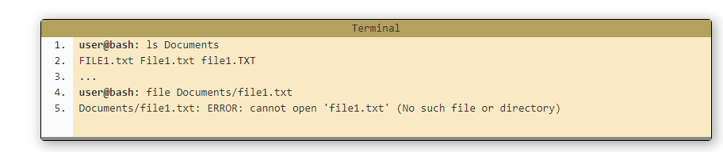

# **Text editor**

#### ***- Choosing A Text Editor***

>I think the best text editor is truly the one that you enjoy using the most. That’s really the best one, isn’t it?

- So what is a text editor?
A text editor is a piece of software that you download and install on your computer, or you access online through your web browser, that allows you to write and manage text, to build a web site.

- The features that you need to look for in a text editor:
  - Code completion
  - Syntax highlighting
  - Nice variety of themes
  - The ability to choose from a healthy selection of extensions available when you need them.

1. **Code completion:** allows you to start typing, and the code completion feature will display possible suggestions based on what you originallytyped.

2. **Syntax highlighting:** is a feature that takes the text you type, and makes it more noticeable by colorizing the text.

>Attributes are a different color than elements. And elements are a different color than copy.

3. **Nice series of themes:** these themes will allow you to change the color of the background of your text editor, the colors in your text.

4. **Extensions:** are like plugins for your text editor, that allow you to have superpowers that you wouldn’t have otherwise.

#### ***- Built-in Text Editor***
- The software that comes on your computer and every computer will come with its own text editor.

  - For Mac computers, the text editor is called,`“Text Edit.”`
  - For Windows computers, the text is called,`“Notepad.”`

  >The reason of why we download nother text editor even that we have one in our computer it's becouse the other text editors have many different features that you may be interested in, like the ones we discussed before. And usually, the text editors that come on your computer don’t have many features to speak of.

#### ***- Third-Party Options***
- it is a text editors that can be downloaded and installed to your computer from the websites.Such as :

  * NotePad++
  - TextWrangler
  - BB Edit 
  - Visual Studio Code  
  - Atom 
  - Brackets
  - Sublime Text 3

  ### ***- The differentiation between the text editor and The Integrated Development Environment (IDE)***

  - **IDE :**is really a suite of different software all coming together. An IDE is a text editor, a file manager, a compiler, and a debugger all in one software package.

  - **Text editor :**it is kind of gives away what it does in the title—it edits text. It also manages text, and manages files.

  -------------------------------------------------------------------------------------------------------------------

  # **Linux**

### ***1. The Command Line***
>Your window into the computer.

  - A command line, or terminal, is a text based interface to the system. You are able to enter commands by typing them on the keyboard and feedback will be given to you similarly as text.
>The command line typically presents you with a prompt. 

#### - Opening a Terminal:

 -  `If you're on a Mac` then you'll find the program Terminal under Applications -> Utilities. An easy way to get to it is the key combination 'command + space' which will bring up Spotlight, then start typing Terminal and it will soon show up.
- `If on Linux` then you will probably find it in Applications -> System or Applications -> Utilities. Alternatively you may be able to 'right-click' on the desktop and there may be an option 'Open in terminal'.
- `If you are on Windows` and intend to remotely log into another machine then you will need an SSH client. A rather good one is Putty (free) 

#### -The Shell, Bash:
 - Within a terminal you have what is known as a shell. This is a part of the operating system that defines how the terminal will behave and looks after running (or executing) commands for you.

>The most common one is called `bash .`

>To know which shell you are using you may use a command called echo to display a system variable stating your current shell.It is a command which is used to display messages.

#### - Shortcuts:
- Shourtcts in linux they make your life easier,and they often save you from making silly mistakes such as typos.

-----------------------------------------------------------------------------------------------------------------------

### ***2. Basic Navigation***

>Let's explore the system.

- Now learning and getting more in the commands :

  1. **`pwd :`**it's stands for Print Working Directory.This command tells you what your current or present working directory is. 
  2. **`ls:`**It's short for list.
  >It will just do a plain listing of our current location. We can do more with ls however.
  `ls [options] [location]`
  In the above example, the square brackets ( [ ] ) mean that those items are optional, we may run the command with or without them. 
 

------------------------------------------------------------

### **- Paths**
- In the previous commands we started touching on something called a path and it is a means to get to a particular file or directory on the system.

**- linux is a hierarchical structure:**
  - At the very top of the structure is what's called the root directory. It is denoted by a single slash ( / ).

- Path types :
  - Absolute: specify a location (file or directory) in relation to the root directory. 
  >You can identify them easily as they always begin with a forward slash ( / )
  - Relative paths specify a location (file or directory) in relation to where we currently are in the system. 
  >They will not begin with a slash.

**- More on Paths:**
 - ~ (tilde) - This is a shortcut for your home directory.
 > eg, /home/ryan/Documents or ~/Documents
 - . (dot) -  This is a reference to your current directory.
 >. eg ./Documents 
 - .. (dotdot)- This is a reference to the parent director and you can use this several times in a path to keep going up the hierarchy. 
 > eg   /home/ryan you could run the command ls ../../ and this would do a listing of the root directory.

- Commands :
  3. **`cd :`**which stands for change directory,we use it in order to move around in the system.
  >`cd [location]`
If you run the command cd without any arguments then it will always take you back to your home directory.

------------------------------------------------------------------------------------------------------------------------

### ***3. More About Files***
>Kinda boring but essential knowledge.

- In linux everything is actually a file,a text file is a file, a directory is a file, your keyboard is a file (one that the system writes to only),your monitor is a file (one that the system writes to only) etc.It is the behaviour of Linux .

**- Linux is an Extensionless System**
- file extension is normally a set of 2 - 4 characters after a full stop at the end of a file.Here is some of common extensions:
  - file.exe - an executable file, or program.
  - file.txt - a plain text file.
  - file.png, file.gif, file.jpg - an image.

  >In other systems such as Windows the extension is important and the system uses it to determine what type of file it is. Under Linux the system actually ignores the extension and looks inside the file to determine what type of file it is.

- Commands :
  4. **`file:`**it help us to know for certain what type of file a particular file is.
>`file [path]`

**- Linux is Case Sensitive**
-  Other systems such as Windows are case insensitive when it comes to referring to files,Linux is not like this.

 

 >Linux sees these all as distinct and separate files.

**- Spaces in names**
- Spaces in file and directory names are perfectly valid but we need to be a little careful with them.

**- Quotes**
- For using quotes you may use either `single or double quotes.`
>Anything inside quotes is considered a single item.

**- Escape Characters**
- It is a backslash `( \ )`,and the backslash doing is escape (or nullify) the special meaning of the next character.

**- Hidden Files and Directories**

- In linux if the file or directory's name begins with a . (full stop) then it is considered to be hidden, and it done for a variety of reasons. Such as configuration files for a particular user.

- Comaands:
  5. **`-a:`** it shows the hidden files and directories.

>This is used with `Ls` command to list a hidden file .
`ls -a Documents`

**References:**

@The Older Coder/[Choosing A Text Editor – The Older Coder](https://codefellows.github.io/code-102-guide/curriculum/class-02/Choosing-A-Text-Editor--The-Older-Coder.pdf)
@Linux /[Linux Tutorial](https://ryanstutorials.net/linuxtutorial/commandline.php)

